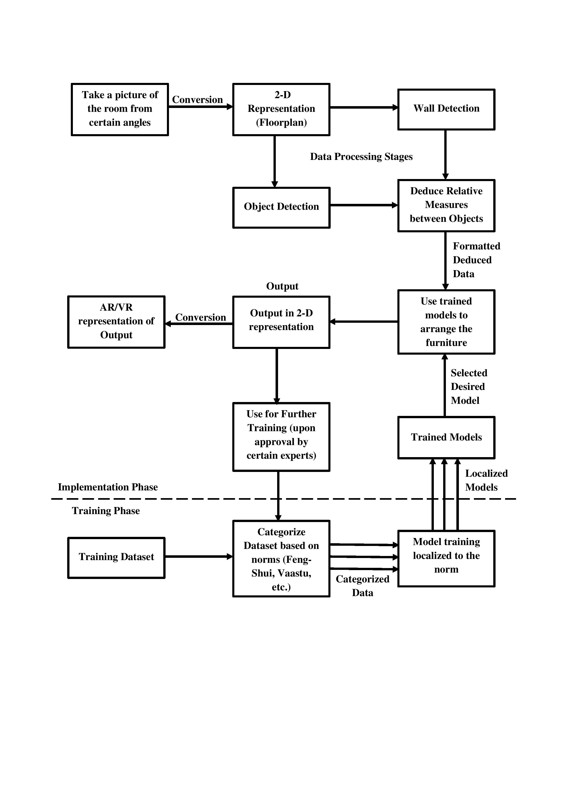

# **AI Guided Space Optimization in Furnished Homes**

## **Aim**  
To automate the process of rearranging furniture around a room according to certain norms like Feng-Shui or Vaastu, using Artificial Intelligence Models.

## **Inspiration**
Usually, the task of furniture arrangements falls into the hands of architects and interior designers. But, it is a bit expensive for many families to be able to afford the furniture and the middle-men. So, the idea of our project was born as a result of the above-mentioned shortcoming to make it easier for middle-class families to arrange furniture aesthetically according to practices like Vaastu or Feng-Shui.

## **Project Abstract**
As mentioned above, our project titled ‘AI guided Space Optimization in Furnished Homes’ aims to automate the process of rearranging furniture around a room according to certain norms like Feng-Shui or Vaastu using Artificial Intelligence Models. Our project idea is one that integrates a handful of contemporary technologies to bring about a solution that can be commercialized, hosted on the cloud and one that has wide-spread applications.  

Our project uses Convolution Neural Networks to train on floorplan datasets to identify the objects, walls, and relative distance between the objects (furniture). Each training dataset is localized to a particular norm such as Vaastu or Feng-Shui and we use localized trained models based on the requirement of the client. Once the model is trained, we can use any untrained floorplan to arrange the furniture in the room autonomously according to the trained norm.  

Our project can be commercialized as no company currently implements an autonomous system such as this. This tool would certainly be beneficial to the company that implements it as it can cut down costs that needs to be paid to architects and designers. This tool can also be used for virtual representation of arranged furniture that will certainly help build client confidence and trust that is vital to any company.  

Since our project requires computationally tasking process such as localized data training and network predictions, it is only sensible to perform such computations on the cloud while the client systems only need to send and receive packets of data to and from the cloud infrastructure. This allows for much lesser computation on the client side and also enables simultaneous training of the models on the cloud which will inherently improve the accuracy of the predictions as time progresses. Hence, this project can righty fall under the domain of iPAAS – Integrated Platform as a Service.  

As mentioned in one of the previous points, this project can implement Augmented Reality with the help of Oculus Rift, Microsoft Holo Lens, Valve Index or the likes of Google Lens to represent the furniture locations using AR with the help of a Camera and a portable device such as a phone. Thus, this project has high potential future applications.  

## **Project Flow**

